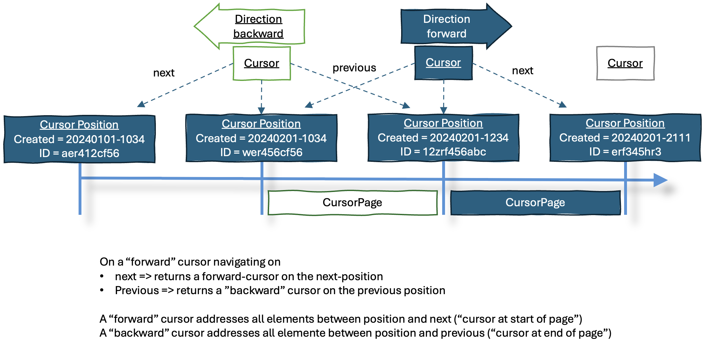

[](https://github.com/p3t/spring-curserpaging/actions/workflows/build.yml)

# Spring Cursor based Paging
Library supporting cursor based paging for Spring Data Repositories.

# Introduction
Cursor based paging is an alternative to the Page/Pagerequest based paging provided by Spring.
It eliminates the need to provide an offset or a page-number which can cause a lot of load on a database in case of very large amount of records in a table.

# Considered Requirements
- The implementation should follow the repository concept from spring.
- Ordering by arbitrary columns should be possible.
- A filtering mechanism should be provided
- Total count of records is not part of the page response and not executed while retrieving the page
- No SQL limit/offset and no DB-cursor should be used
- State is send to the client and returned to the server for the next page

# Quickstart / how to use it
under construction / todo
- [ ] Describe how to include dependency in maven.pom / build.gradle
- [ ] Different options to use repository interface(s)

Until done, please check the testapp sourcecode.

## Include the cursorpaging library in you maven pom / build.gradle

TODO (not yet published)

## Generate the JPA meta-model

The cursorpaging library is using the JPA meta-model to generate the queries.
This is done by the `hibernate-jpamodelgen` annotation processor (in case you are using eclipse-link or another ORM
there should be a similar one available.

### Maven configuration

```xml

<project>

  <!-- ... -->
  <plugin>
    <groupId>org.apache.maven.plugins</groupId>
    <artifactId>maven-compiler-plugin</artifactId>
    <version>3.8.1</version>
    <configuration>
      <annotationProcessorPaths>
        <path>
          <groupId>org.hibernate.orm</groupId>
          <artifactId>hibernate-jpamodelgen</artifactId>
          <version>${hibernate.version}</version>
        </path>
      </annotationProcessorPaths>
    </configuration>
  </plugin>
  <!-- ... -->

</project>
```

### Gradle configuration

```kotlin
dependencies {
    annotationProcessor("org.hibernate:hibernate-jpamodelgen:6.4.4.Final")
}
```

## Register the CursorPageRepositoryFactoryBean

In order to use the repository interface an modified `JpaRepFactoryBean` is needed.
This is done via `@EnableJpaRepositories` annotation in the Spring Boot Application class.

```java

@SpringBootApplication
@EnableJpaRepositories( repositoryFactoryBeanClass = CursorPageRepositoryFactoryBean.class )
public class TestApplication {

    public static void main( String[] args ) {
        SpringApplication.run( TestApplication.class, args );
    }
}
```

This implementation checks, whether the a fragment interface of the repository to be instantiated is
a `CursorPageRepository` and if so, it will create a `CursorPageRepositoryImpl` instead of the default.

An alternative, which works without an extra factory implementation, would be to derive for each entity an additional
repository-interface and create a repository-impl aside, passing the required arguments (entity class & entity-manager)
to the constructor of the `CursorPageRepositoryImpl`.

## Define a repository interface

As used with spring-data, create a repository for each of the data-entities:

```java

@Repository
public interface DataRecordRepository
        extends JpaRepository<DataRecord, UUID>, CursorPageRepository<DataRecord> {

}
```

## Query data / build page requests

From your service you can now use the JPA Metamodel in order to define which properties are relevant for the positions
and how the results should be ordered.

### Example: Use id, order records ascending

There are various shortcut APIs available to make the creation of the requests as easy as possible

```java
public void queryData() {
    final PageRequest<DataRecord> request = PageRequest.attributeAsc( DataRecord_.id );
    final Page<DataRecord> page = dataRecordRepository.findPage( request );
    page.forEach( System.out::println );

    // get the next page:
    final var nextPage = dataRecordRepository.loadPage( firstPage.next().orElseThrow() );
    nextPage.forEach( System.out::println );
}
```

Each returned page contains a "next-request" which can be used to query the following records.
The next request will be absent, in case there are no more records available.
The page-size is the same as the one used for the first request, but could be adjusted:

```java 
public void queryData() {
    // ...
    final var next = firstPage.next();
    assertThat( next ).isPresent();
    final var nextPage = dataRecordRepository.loadPage( next.get().withPageSize( 20 ) );
}
```

### Example: Use creation time, order records descending

```java
public void queryData() {
    final PageRequest<DataRecord> request = PageRequest.create( b -> b.pageSize( 100 )
            .attributeDesc( DataRecord_.createdAt ).attributeAsc( DataRecord_.id ) );

    final Page<DataRecord> page = dataRecordRepository.findPage( request );
    page.forEach( System.out::println );
}
```

The first given attribute is the primary sort order, the second the secondary and so on.

*Important*: The combination of all attributes defined in the request must uniquely identify one single entity.
Otherwise you will get unexpected results! Most easy is to use the primary key of the entity (at least as secondary
attribute, if you want to get the records ordered e.g. by a name or creation data)

### Example: Use a filter

```java
public void queryData() {
    final PageRequest<DataRecord> request = PageRequest.create( b -> b.pageSize( 100 )
            .attributeDesc( DataRecord_.createdAt ).attributeAsc( DataRecord_.id )
            .filter( Filter.attributeIs( DataRecord_.name, "Alpha" ) ) );

    final Page<DataRecord> page = dataRecordRepository.findPage( request );
    page.forEach( System.out::println );
}
```

This will only return `DataRecords` with name "Alpha". It is possible to add multiple filters for different attributes
or to provide multiple values for one attribute (one must match).

### There is no total count in the Page...

Executing a count operation can be a quite expensive operation! Therefore, the total count of records is not part of the
page response. It is also usually not required to re-count all records with each page request!
So, if you need to know the total count of records, you can execute a count query on the repository:

```java
// Simple to optimize by caching...
@Cacheable( "datarecord.count" )
public long queryCount() {
    final long count = dataRecordRepository.count();
    System.out.println( "Total records: " + count );
    return count;
}
```

# Background: Concept description
## Basic idea
A Cursor is nothing elsa than a position in a list of records.
The content of the page is just the next n-records after the cursor.
It is important, that the records do have a well defined order, to make this return predictable results.

Databases are very fast, when querying indexed columns or fields. 
Most DBs do have something like an ID/Primary Key (PK) to uniquely identify a record, still a cursor must not be restricted to only use PKs.

Assuming we use a numeric PK a query for the first page could look like this:
```sql
SELECT * FROM table WHERE id > 0 ORDER BY id ASC LIMIT 10
```  
The next cursor is the last id of the result set. Page 2 would look like this:
```sql
SELECT * FROM table WHERE id > 10 ORDER BY id ASC LIMIT 10
```
and so on. 

In real life this is a little more complicated as the desired order of the records depends on the use case (could e.g. creation time or a status-field), and there is no gurantee that this order doesn't change from query to query.

## Design model(s)


# Making things more complicate
Potentially, a curosr can be reversed, meaning  the query direction can be changed. This would add the feature to the cursor page to not only point to the next page but also to the previous result-set. Still - this must not be misunderstood as the privous page! This is not easily possible, because for doing this it would be needed to have all previous pages still in memory or somehow stored with the cursor.
Such an reversed cursor is, when used, changing the direction of the query.



There is only value in this feature, if the client is not able to cache the previous requested pages by himself, i.e. forgets them while moving forward. This might be the case in a very memory limited client scenario which is usually _not_ a web application/web browser.

## Limitations
- Such a cursor implementation is not transaction-safe. Which is good enough for most UIs and it is not so important, to miss a record or have a duplicate one in two page requests. This is i.e. the case when the PK is not an ascending numerical ID but maybe an UUID, so that it is possible that an inserted record apears before the page which a client is going to request. In case you need transaction-safe cursor queries, this is most likely a server-side use case and you can use DB-cursors.


