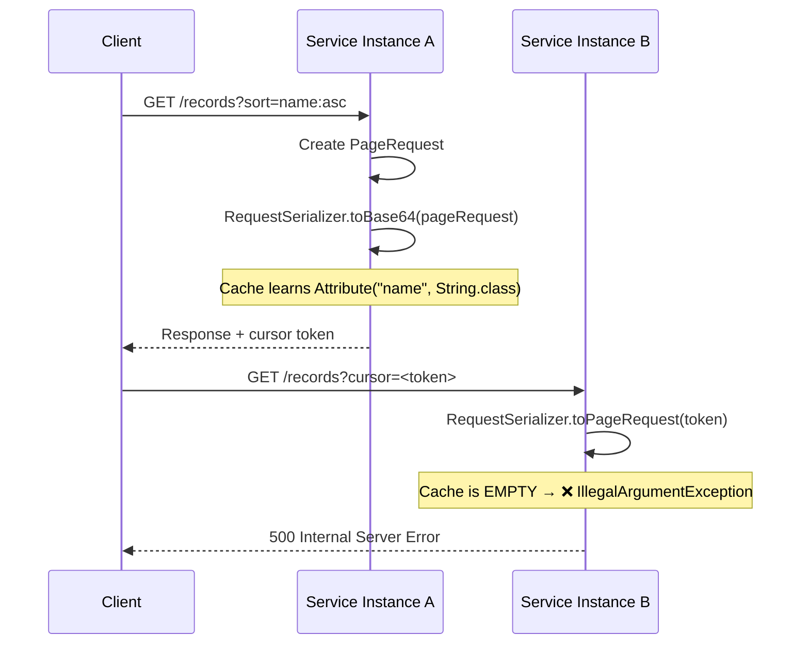
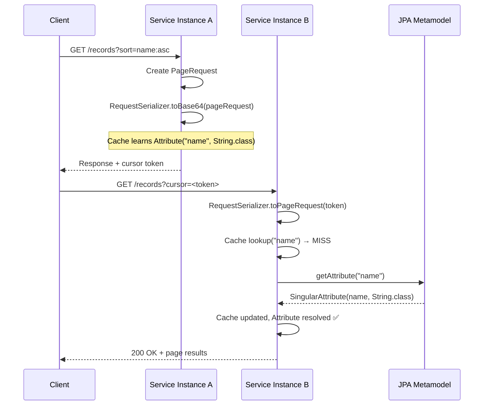

# ADR: Attribute Resolution on Cursor Deserialization

| Property   | Value                                      |
|------------|--------------------------------------------|
| **Date**   | 2025-04-15                                 |
| **Status** | Accepted                                   |
| **Scope**  | `cursorpaging-jpa-api`, `cursorpaging-jpa` |

## Context and Problem Statement

The `RequestSerializer` maintains an in-memory cache (`Map<String, Attribute>`) that maps
an attribute's dot-separated name (e.g. `"auditInfo.createdAt"`) to a fully typed `Attribute`
object (containing a `List<SingleAttribute>`, each with a `name` and a Java `Class<?> type`).

During **serialization** (`toBytes` / `toBase64`), the cache is populated from the
`PageRequest` being serialized ("learning"). During **deserialization** the cache is consulted
to reconstruct the `Attribute` from the name string stored in the protobuf:

```java
// FromDtoMapper.java (current)
private Attribute attributeOf( final Cursor.Attribute attribute ) {
    final var cursorAttribute = attributesByName.get( attribute.getName() );
    if ( cursorAttribute == null ) {
        throw new IllegalArgumentException( "No attribute found for name: " + attribute.getName() );
    }
    return cursorAttribute;
}
```

The protobuf schema only stores the **name**, not the type information:

```protobuf
message Attribute {
  string name = 1;   // e.g. "auditInfo.createdAt"
}
```

### Why this is a problem

In deployments where **serialization and deserialization happen in different service instances**
(e.g. behind a load-balancer, or after a rolling restart) the cache on the deserializing
instance may be empty or incomplete. This causes deserialization to fail with:

> `IllegalArgumentException: No attribute found for name: auditInfo.createdAt`

The current workaround — pre-registering all attributes via
`RequestSerializerBuilder.use(Attribute)` — is error-prone and requires manual maintenance
whenever the entity model changes.

### Overview — Current Serialize / Deserialize Flow



## Decision Drivers

* **Reliability** — Deserialization must work regardless of which instance handles the request.
* **Correctness** — Resolved `Attribute` must carry accurate type information for value conversion.
* **Security** — The resolution mechanism must not open deserialization / injection attack vectors.
* **Minimal coupling** — Prefer solutions that do not add heavy new dependencies to `cursorpaging-jpa-api`.
* **Backward compatibility** — Existing configurations using `.use(Attribute)` and the cache must keep working.

## Considered Options

### Option 1 — Enrich the Protobuf Schema with Type Information

Serialize the full `SingleAttribute` path (name + fully qualified class name) into the
protobuf message so that the deserializer is self-contained.

**Protobuf change:**

```protobuf
message SingleAttribute {
  string name = 1;
  string type = 2;  // e.g. "java.time.Instant"
}

message Attribute {
  string name = 1;                    // kept for readability
  repeated SingleAttribute path = 2;  // NEW
}
```

**Deserialization would use `Class.forName(type, false, classLoader)`** to reconstruct the
`SingleAttribute` instances.

#### Pros

* Fully self-contained — no `EntityManager` or JPA Metamodel required at deserialization time.
* Works across services as long as entity classes are on the classpath.
* No cache needed at all.

#### Cons

* **Breaking protobuf schema change** — requires migration/versioning strategy for existing tokens (as they are usually
  only short-living this would be acceptable).
* **Security risk via `Class.forName()`** — even though cursors are encrypted
  (ChaCha20-Poly1305), defence-in-depth requires an explicit allowlist of permitted types
  to prevent class-loading attacks. Maintaining such an allowlist adds ongoing effort.
* **Increases cursor token size**.

### Option 2 — JPA Metamodel-Based Resolution (Fallback on Cache Miss)

Introduce an `AttributeResolver` abstraction into the serializer. On cache miss, delegate to
a resolver that walks the JPA `Metamodel` to reconstruct the `Attribute` from the
dot-separated name — the same approach already proven in the existing
`JpaMetamodelAttributeResolver` in the `cursorpaging-jpa-rsql` module.

#### Pros

* **No protobuf schema change** — fully backward compatible with existing tokens.
* **Metamodel is the single source of truth** — guarantees correct types including
  `@Embedded`, `@MappedSuperclass`, and `@AttributeOverride` mappings.
* **Inherently secure** — `ManagedType.getAttribute(name)` throws
  `IllegalArgumentException` for any name that doesn't exist on the entity.
  Combined with the existing ChaCha20-Poly1305 encryption, the attack surface is negligible.
* **Same pattern** as in `JpaMetamodelAttributeResolver`.
* Cache remains as a **performance optimization** (first-hit bypass of Metamodel walk).

#### Cons

* Requires a JPA `EntityManager` / `Metamodel` at deserialization time (available in any
  Spring JPA context, but not in plain unit tests without mocking or in a future MongoDB implementation).
* The `AttributeResolver` interface must be accessible from `cursorpaging-jpa-api`; it
  currently lives in `cursorpaging-jpa-rsql`.

### Option 3 — Reflection-Based Resolution (Fallback on Cache Miss)

Walk the entity's Java class hierarchy using `Class.getDeclaredField()` to determine the
type of each path segment.

#### Pros

* No `EntityManager` / Metamodel required — works in any context.
* No protobuf schema change.
* `entityType` is already known by `RequestSerializer`.

#### Cons

* **Does not account for JPA-specific mappings** (`@AttributeOverride`,
  `@Access(AccessType.PROPERTY)`, column-name vs. field-name mismatches).
* Fragile for `@MappedSuperclass` hierarchies and generic types.
* Less correct than the Metamodel for entity structures that diverge from plain field layout.

### Option 4 — Hybrid (Metamodel + Reflection Fallback)

Combine Options 2 and 3: try cache → Metamodel → Reflection.

#### Pros

* Maximum flexibility — works even without JPA (e.g. in tests, with reflection fallback).

#### Cons

* Added complexity with two fallback strategies that may produce subtly different results.
* Reflection fallback may mask Metamodel configuration issues.

## Decision

**Option 2 — JPA Metamodel-Based Resolution** is selected.

The JPA Metamodel is the authoritative source for entity attribute structure and types.
It resolves the cache-miss problem reliably in all production deployments (where an
`EntityManager` is always available) while providing inherent security through its
built-in validation.

## Implementation Design

### 1. Move `AttributeResolver` Interface to `cursorpaging-jpa`

The `@FunctionalInterface` is relocated from `cursorpaging-jpa-rsql` so it is
available to both the API serializer and the RSQL module without introducing a
circular dependency.

```
cursorpaging-jpa (new home)
  └── io.vigier.cursorpaging.jpa.AttributeResolver
  └── io.vigier.cursorpaging.jpa.impl.JpaMetamodelAttributeResolver
         implements AttributeResolver
         
cursorpaging-jpa-rsql (reuses, no longer owns the interface and JpaMetamodelAttributeResolver)

cursorpaging-jpa-api (uses for deserialization fallback)
  └── io.vigier.cursorpaging.jpa.serializer.RequestSerializer
         accepts an optional AttributeResolver
```

```java
// cursorpaging-jpa: io.vigier.cursorpaging.jpa.AttributeResolver
@FunctionalInterface
public interface AttributeResolver {
    /**
     * Resolve a dot-separated attribute path (e.g. "auditInfo.createdAt")
     * to a fully typed {@link Attribute}.
     *
     * @param name the dot-separated attribute path
     * @return the resolved attribute
     * @throws IllegalArgumentException if the name cannot be resolved
     */
    Attribute resolve( String name );
}
```

### 2. Add `AttributeResolver` to `RequestSerializer`

```java
// RequestSerializer.java
@Builder.Default
private final AttributeResolver attributeResolver = (name -> {
            throw new SerializerException(
                    "No attribute found for name: " + name + " (no AttributeResolver configured)" );
        });
```

### 3. Pass `AttributeResolver` Through to `FromDtoMapper`

```java
// RequestSerializer.toPageRequest()
final FromDtoMapper<E> fromDtoMapper = FromDtoMapper.create( b -> b.request( request )
                .conversionService( conversionService )
                .ruleFactories( filterRuleFactories )
                .attributesByName( attributes )
                .attributeResolver( attributeResolver ) );   // NEW
```

### 4. Resolve on Cache Miss in `FromDtoMapper`

```java
// FromDtoMapper.java
private final AttributeResolver attributeResolver;  // nullable

private Attribute attributeOf( final Cursor.Attribute attribute ) {
    var resolved = attributesByName.computeIfAbsent( attribute.getName(),
            name -> attributeResolver.resolve( attribute.getName() ) );
    if ( resolved == null ) {
        throw new SerializerException( "No attribute found for name: " + attribute.getName() );
    }
    return resolved;
}
```

### 5. Updated Deserialization Flow



### 6. Wire in Application Configuration

The `RequestSerializerFactory` should require the `EntityManager` dependency and create an `AttributeResolver` bean that
uses the
Metamodel with the given entity-type when a serializer is created.

### Security Considerations

| Layer                    | Protection                                                                                                                                                       |
|--------------------------|------------------------------------------------------------------------------------------------------------------------------------------------------------------|
| **Encryption**           | Cursor tokens are encrypted with ChaCha20-Poly1305 (AEAD). Tampering invalidates the authentication tag → `CryptoException`.                                     |
| **Metamodel validation** | `ManagedType.getAttribute(name)` only resolves attributes that exist on the JPA entity. Any unknown name throws `IllegalArgumentException`.                      |
| **No `Class.forName()`** | Unlike Option 1, this approach never loads arbitrary classes. Type information comes exclusively from the Metamodel.                                             |
| **Shared secret**        | In multi-instance deployments, the encryption secret is shared via configuration (e.g. Secret Manager), ensuring tokens are only decodable by trusted instances. |

An attacker would need to:

1. Obtain the ChaCha20 encryption key, **and**
2. Craft a valid protobuf payload with an attribute name that exists on the entity.

Even in that scenario, the Metamodel restricts resolution to legitimate entity attributes,
preventing any form of code execution or class-loading attack.

## Consequences

### Positive

* Cursor deserialization becomes **reliable across service instances** without requiring
  pre-registration of all attributes via `.use()`.
* The existing `.use()` / cache mechanism remains as a **performance optimization** —
  cached attributes bypass the Metamodel walk entirely.
* **No breaking changes** — the protobuf schema, token format, and public API remain unchanged.
  The `attributeResolver` is optional; existing configurations without it continue to work as before.
* The `AttributeResolver` abstraction allows for alternative implementations (e.g. reflection-based)
  in contexts where JPA is not available, providing a clean extension point.

### Negative

* Deserialization in contexts **without an `EntityManager`** (e.g. pure unit tests) still
  requires either pre-registered attributes (`.use()`) or a mocked/alternative `AttributeResolver`.
* Slight **performance overhead** on the first cache miss per attribute (Metamodel walk).
  Subsequent requests for the same attribute hit the cache.

### Neutral

* The `AttributeResolver` interface moves from `cursorpaging-jpa-rsql` to `cursorpaging-jpa`.

