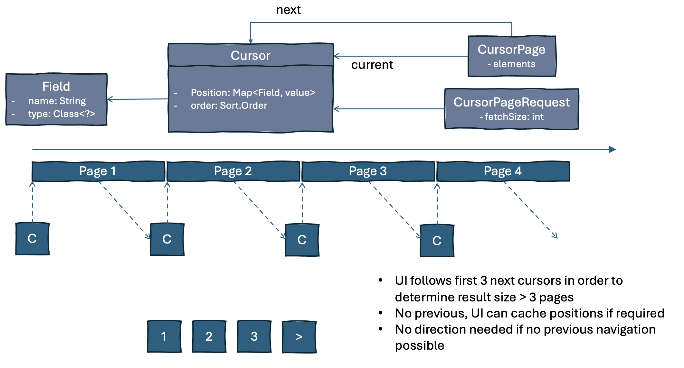

# Concept: Cursor-Based Paging

## The Problem with Offset-Based Paging

Traditional page/offset paging (e.g. `OFFSET 10000 LIMIT 10`) forces the database to scan and skip all preceding rows before returning the requested page. As the offset grows, performance degrades significantly.

Cursor-based paging avoids this by always starting from a **known position** — there is no offset to skip.

## Basic Idea

A **cursor** is a position in an ordered list of records. The page content is simply the next _n_ records after that position. The records must have a well-defined, stable order.

Assuming a numeric primary key, the first page is:

```sql
SELECT * FROM some_table WHERE id > 0 ORDER BY id ASC LIMIT 10
```

If the last returned ID is 10, the second page is:

```sql
SELECT * FROM some_table WHERE id > 10 ORDER BY id ASC LIMIT 10
```

No offset is needed — the database can use an index to jump directly to the right position.

## Multi-Attribute Cursors

In practice the sort order often includes non-unique fields (e.g. creation date, status). In that case the cursor is composed of **multiple attributes**, and the combination must uniquely identify a single record. Adding the primary key as the last attribute is the recommended pattern.

## Design Model



## Reversed Cursors

A cursor can be **reversed**: the query direction flips while the sort order stays the same. This can be used to traverse *backwards* from the current position — useful when the client cannot cache previously fetched pages.

A reversed cursor is **not** the "previous page" in the traditional sense. It returns the records that come before the current cursor position, in a new forward-traversal order.


See [Reversing Pages](reversing.md) for the API details.

## Limitations

- **Side-effects cannot be avoided:** If records are inserted or deleted between page requests, duplicates or gaps may occur.
- The cursor combination must be **unique** — otherwise results are unpredictable.
- There is no direct "jump to page N" capability; the cursor is inherently sequential.

---

Back: [README](../../README.md) · [Querying Pages](querying-pages.md)

